# 👩🏽‍💻 Curso Prático de SQL — IFSULDEMINAS

Este repositório reúne a resolução prática de exercícios e a construção de scripts desenvolvidos ao longo da formação do IFSULDEMINAS. 

Em vez de um único projeto isolado, o foco esteve no **domínio prático dos comandos e cláusulas do SQL**, cobrindo desde a estruturação do banco até a geração de consultas analíticas.

---

## 🔄 Ciclo de Vida do Curso

| Módulo | Práticas |
| :---: | :---: |
| **1. DDL** | Criação do Esquema (Tabelas e Restrições) |
| **2. DML** | Inserção, Atualização e Deleção Segura |
| **3. Relatórios** | Consultas Analíticas: JOINs, FILTROS, COALESCE, GROUP BY e HAVING |
---

## 🛠️ Tecnologias e Ferramentas
* **Linguagem:** SQL
* **Sistema Gerenciado de Banco de Dados (SGBD):** SQLite
* **Ambiente de Execução:** SQLiteOnline

---

## 🎯 Etapas do Projeto & Aprendizados

### 1️⃣ Criação de Esquema (DDL)
* 1.1 Estruturação das tabelas `clientes` e `pedidos`.
* 1.2 Aplicação de `PRIMARY KEY`, `FOREIGN KEY`, `NOT NULL`, `UNIQUE` e `DEFAULT`.
* 1.3 Garantia de integridade referencial entre entidades.

| Tabela Cliente e Pedidos |
| :---: |
| 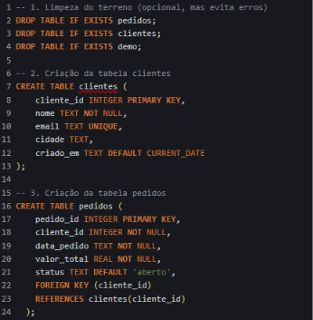 |

---

### 2️⃣ Inserção e Manipulação de Dados (DML)
* 2.1 Preenchimento inicial de registros (`INSERT INTO`).

| Inserção de Clientes | Inserção de Pedidos |
| :---: | :---: |
| 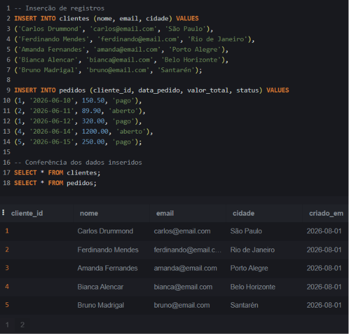 | 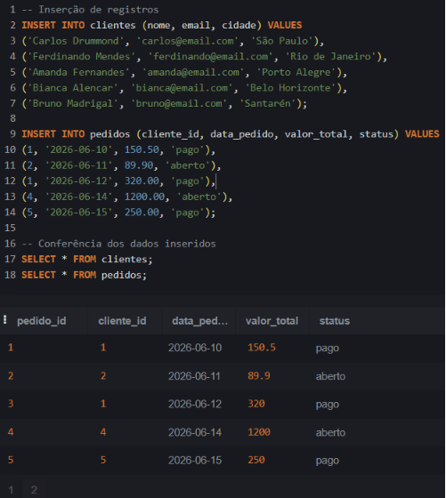 |

* 2.2 Práticas de **alteração e deleção segura** (`UPDATE` e `DELETE`) utilizando blocos transacionais (`BEGIN TRANSACTION`, `COMMIT`, `ROLLBACK`) e conferência prévia via `SELECT`.

| Atualização (UPDATE) | Remoção (DELETE) |
| :---: | :---: |
| 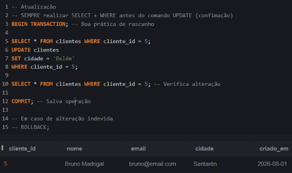 | 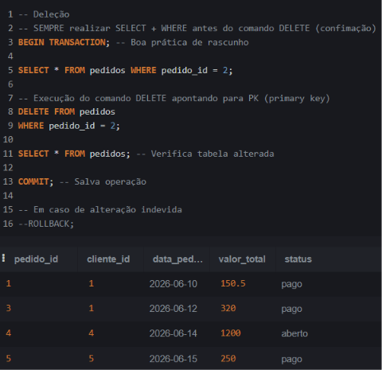 |

---

### 3️⃣ Consultas, Filtros, Agregações e Relatórios Analíticos
* 3.1 Filtros e Cruzamento de dados com `JOIN`.

| Filtro por Cidade | Filtro por Valor + JOIN |
| :---: | :---: |
| 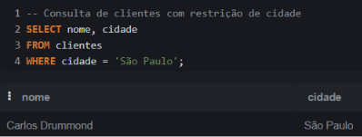 | 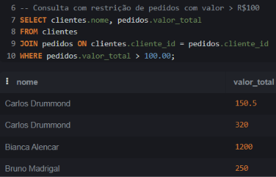 |

| Filtro por Status + JOIN | Filtro por valor + JOIN |
| :---: | :---: |
| 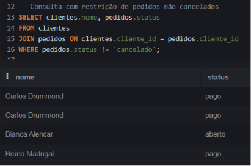 |  |

* 3.2 Junção de dados com `LEFT JOIN` e Tratamento de Valores `NULL` com a Função `COALESCE`.

| Valor NULL sem tratativa + LEFT JOIN | Valor NULL com tratativa COALESCE + LEFT JOIN |
| :---: | :---: |
| 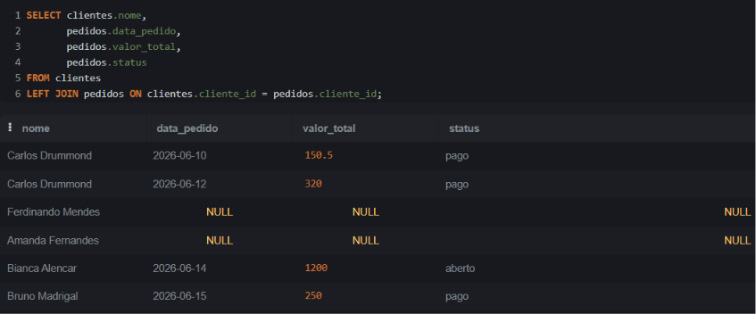 | 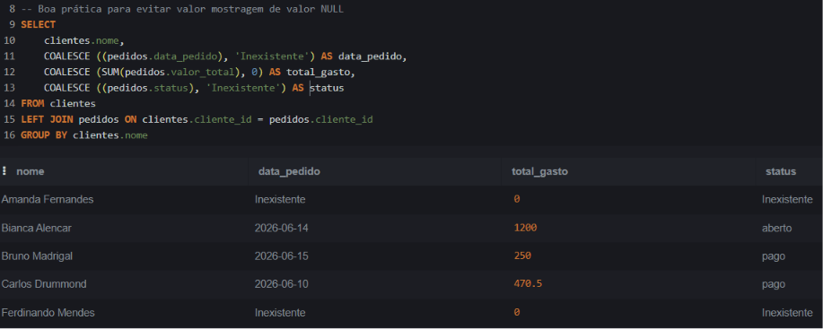 |

---

* 3.3 Funções de Agregação, Agrupamento e Ordenação (`COUNT`, `SUM`, `AVG`, `MAX`, `MIN`) com `GROUP BY` e `ORDER BY`.

| Função de Contagem + Group By | Função de Soma + Group e Order By |
| :---: | :---: |
| 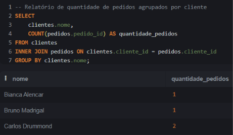 | 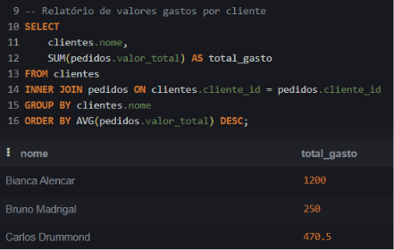 |

| Função de Média + Group By | Relatório Completo de Vendas por Cliente | 
| :---: | :---: | 
| 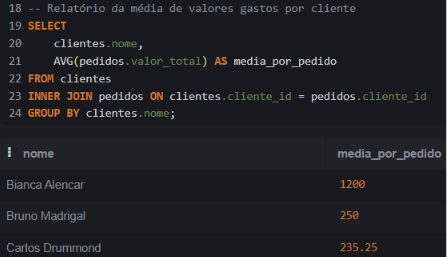 | 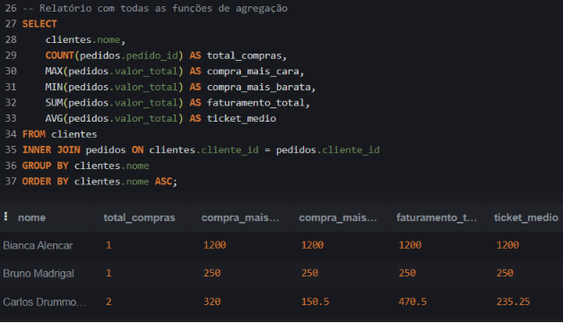 |
  
| Ordenação Crescente | Ordenação Decrescente |
| :---: | :---: | 
| 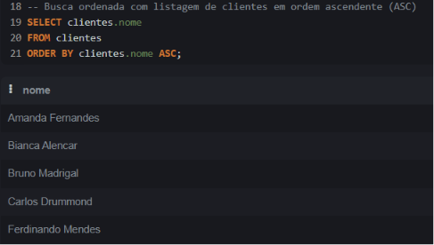 | 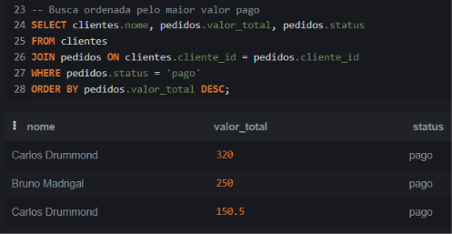 |

---

* 3.4 Filtragem de resultados agrupados via restrição `HAVING`.

| Relatório com Cláusula HAVING |
| :---: |
| 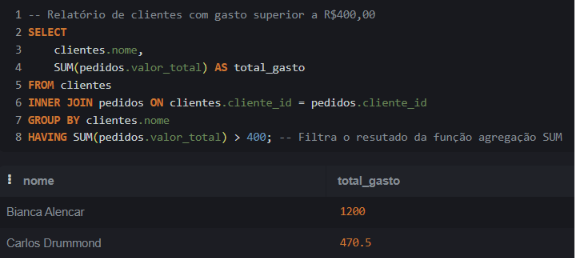 |

---

## 📂 Como Executar os Scripts
1. Acesse o [SQLiteOnline](https://sqliteonline.com/).
2. Execute os arquivos SQL na ordem indicada dentro da pasta `scripts/`.

> **⚠️ OBS:** Como o SQLite Online roda na memória temporária (RAM), assim que a aba for fechada ou atualizada, todos os dados criados serão apagados.
